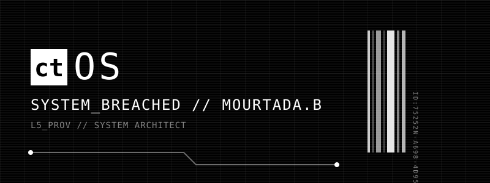

<div align="center">
  
</div>

```text
> BEGIN_LINK_ESTABLISHED - AU-3087H-INST-2
> LOG_STREAM_CONNECTED // ID75252N
> SYSTEM_OS_INITIALIZING...
> [BLUME_IDP] Opened session for user(MOURTADA.B)
```

### ⚙️ SYSTEM_SPECS // SKILLS
<p align="center">
  
  
  
  
  
  
  
  
  
</p>

### 📊 NODE_TELEMETRY // STATS
<p align="center">
  
  
</p>

### 📡 ACTIVE_BREACHES // PROJECTS
| ID | TARGET | CLASSIFICATION |
|---|---|---|
| **01** | [MINISHELL](#) | Unix shell implementation in C. POSIX compliant. |
| **02** | [INCEPTION](#) | Docker-based infrastructure. Nginx, MariaDB, WordPress. |
| **03** | [CUB3D](#) | 3D engine based on raycasting in C. |

<br/>
<p align="center">
  <i>Property of Blume Corp. All usage is subject to Central Active Monitoring.</i>
</p>
