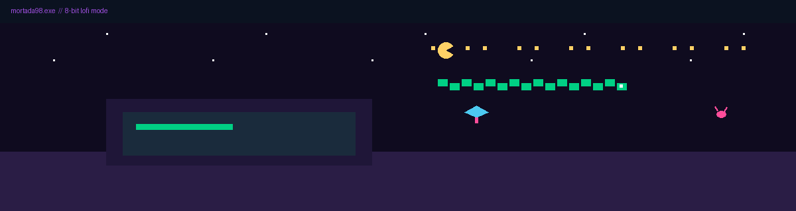
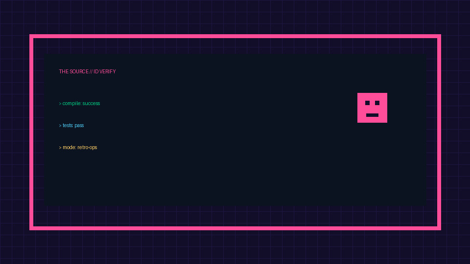
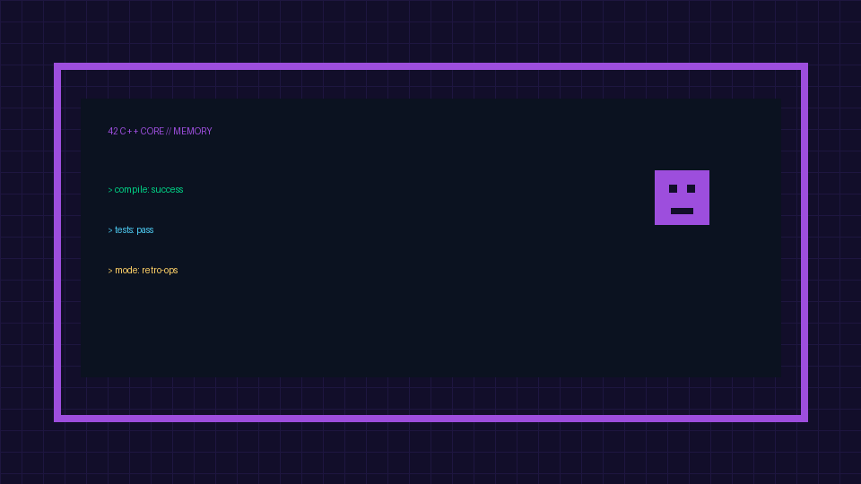

<div align="center">
  
  <p><strong>Mortada98.exe</strong> • Software Engineer • 42 Network</p>
  <p><sub>If the animation does not load, view profile: <a href="https://github.com/Mortada98">github.com/Mortada98</a></sub></p>
</div>

---

<div align="center">

```text
> boot sequence: online
> mode: 8-bit x lofi
> mission: build reliable systems, tune linux workflows, ship practical AI tooling
```

</div>

<div align="center">
  
  
  
</div>

## 🧩 Pixel Skills Grid

<div align="center">
  
</div>

## 🕹️ Retro Project Cards

<table>
  <tr>
    <td width="50%" valign="top">
      
      <br/>
      <strong>The Source</strong><br/>
      AI-powered digital identity verification platform.<br/>
      Focus: security checks, validation flow, practical deployment.
    </td>
    <td width="50%" valign="top">
      
      <br/>
      <strong>42 C++ Core</strong><br/>
      Deep dive into memory, architecture, and low-level optimization.<br/>
      Focus: robust abstractions and predictable performance.
    </td>
  </tr>
</table>

## 📡 Pixel Telemetry

<div align="center">
  <a href="https://github.com/Mortada98">
    
  </a>
  <a href="https://github.com/Mortada98">
    
  </a>
</div>

<div align="center">
  
  <p><sub>Fallback: activity is always available on the profile contribution graph.</sub></p>
</div>

## 📬 Contact Node

<div align="center">
  <a href="https://github.com/Mortada98">GitHub</a> •
  <a href="https://github.com/Mortada98/Mortada98/issues">Issues</a> •
  <a href="https://www.youtube.com/results?search_query=lofi+hip+hop+radio">Lofi Stream</a>
</div>
