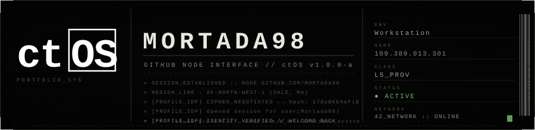
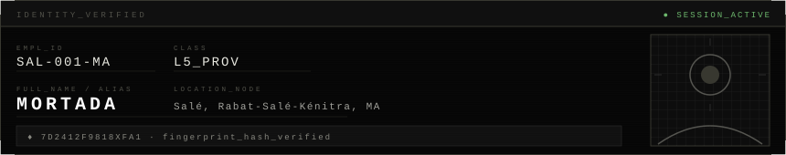
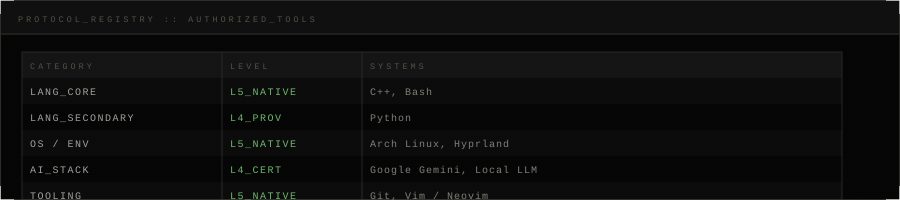

<!--
  ╔══════════════════════════════════════════════════════════════════════╗
  ║  ctOS PROFILE :: GITHUB NODE INTERFACE v2.0.0                      ║
  ║  Property of Mortada. Sentinel Active Monitoring.                  ║
  ║  blume-krn-1.0.8 ↔ ctOS-1.0.0-b                                   ║
  ╚══════════════════════════════════════════════════════════════════════╝
-->

<div align="center">



</div>

<br/>

<div align="center">

```
╔══════════════════════════════════════════════════════════════════════╗
║  IDENTITY VERIFIED                                                  ║
║  ──────────────────────────────────────────────────────────────     ║
║  EMPL_ID   SAL-001-MA          CLASS    L5_PROV                     ║
║  ALIAS     Mortada98           NODE     MA :: MOROCCO               ║
║  SESSION   ACTIVE              UPTIME   42_NETWORK :: ONLINE        ║
║  ROLE      Software Engineer   FOCUS    C++ · AI Systems            ║
╚══════════════════════════════════════════════════════════════════════╝
```

</div>

<br/>

<div align="center">

```
» LOG_STREAM_CONNECTED // 1975C5F6-460B-4E95-A05B-4E314A9CF13F
» WS_OUTPUT_FOUND: OP_3 <-> ADDR_PTR: 0xFD83A001
» .................... OVERRIDE_OS_INITIALIZING ....................
» [BLUME_IDP] Using Protocol: GITHUB_PROFILE_v2
» [ROUTING] [ CIPHER_NEGOTIATED <-> hash: 17duBKEAaFiB`1kk ]
» [BLUME_IDP] Opened session for user(root)
» LOADING PROFILE DATA... ▌
```

</div>

---

<!-- ░░░░░░░░░░░░░░░░░░░░░░░░░ SECTION 01 :: PROFILE ░░░░░░░░░░░░░░░░░░░░░░░░░ -->

<div align="center">

</div>

<br/>

<div align="center">

</div>

<br/>

```
┌─────────────────────────────────────────────────────────────────────┐
│  OPERATOR_PROFILE :: MORTADA                                        │
│  ──────────────────────────────────────────────────────────────     │
│  ROLE      Software Engineer advancing through the 42 Network      │
│  FOCUS     C++ Architecture  ·  AI / LLM Systems                   │
│  MISSION   Building The Source — AI-powered identity platform       │
│  CLEARANCE L5_PROV :: Senior / Independent Operator                │
│  OS        Arch Linux + Hyprland (Wayland compositor)              │
│  STATUS    ● ACTIVE — All commits monitored. Sentinel ON.          │
└─────────────────────────────────────────────────────────────────────┘
```

> Systems engineer deep in the 42 Network C++ curriculum.  
> Building *The Source* — an AI-powered digital identity verification platform.  
> All output is logged. All commits are monitored. Sentinel active.

---

<!-- ░░░░░░░░░░░░░░░░░░░░░░░░ SECTION 02 :: CAPABILITIES ░░░░░░░░░░░░░░░░░░░░░░ -->

<div align="center">

</div>

<br/>

<div align="center">

</div>

<br/>

<div align="center">

<!-- Primary language badges -->
&nbsp;
&nbsp;


<!-- OS & tooling badges -->
&nbsp;
&nbsp;
&nbsp;


<!-- AI / LLM badges -->
&nbsp;


</div>

---

<!-- ░░░░░░░░░░░░░░░░░░░░░░░░░ SECTION 03 :: ARCHIVES ░░░░░░░░░░░░░░░░░░░░░░░░░ -->

<div align="center">

</div>

<br/>

```
─────────────────── PROJECT_REGISTRY :: STATUS_ACTIVE ───────────────────
```

**`[PRJ-001]`** &nbsp; **THE-SOURCE** &nbsp;&nbsp; `● ACTIVE`

```
EMPL_ID   proj-src-001
DESC      AI-powered digital identity verification platform.
          Integrates LLM-driven profile analysis and biometric hashing.
STACK     Python · Google Gemini · Local LLM · Arch Linux
ADDR      PRIVATE :: IN_DEVELOPMENT
STATUS    ● ACTIVE — Primary mission. All cycles allocated.
```

---

**`[PRJ-002]`** &nbsp; **42-CPP-CORE** &nbsp;&nbsp; `● ACTIVE`

```
EMPL_ID   proj-cpp-001
DESC      Deep C++ architecture — memory management, low-level systems
          optimization, and kernel-adjacent programming via 42 Network.
STACK     C++ · Bash · Arch Linux · GDB · Valgrind
ADDR      PRIVATE :: IN_DEVELOPMENT
STATUS    ● ACTIVE — Advancing through C++ modules.
```

---

**`[PRJ-003]`** &nbsp; **HYPRLAND-ENV** &nbsp;&nbsp; `◌ ONGOING`

```
EMPL_ID   proj-env-001
DESC      Custom Hyprland Wayland compositor environment and dotfiles.
          Full keyboard-driven, minimal, cyber-aesthetic setup.
STACK     Bash · Arch Linux · Hyprland · Waybar · Rofi
ADDR      PRIVATE :: IN_DEVELOPMENT
STATUS    ◌ ONGOING — Continuous iteration.
```

```
─────────────────────────────── END_REGISTRY ────────────────────────────
```

---

<!-- ░░░░░░░░░░░░░░░░░░░░░░░░░ SECTION 04 :: METRICS ░░░░░░░░░░░░░░░░░░░░░░░░░ -->

<div align="center">

</div>

<br/>

<div align="center">


</div>

---

<!-- ░░░░░░░░░░░░░░░░░░░░░░░░ SECTION 05 :: COMMS ░░░░░░░░░░░░░░░░░░░░░░░░░░░░ -->

<div align="center">

```
┌───────────────────────────────────────────────────────────────────┐
│  AUTHORIZED CONTACT PROTOCOLS                                     │
├───────────────────────────────────────────────────────────────────┤
│  CHANNEL     GITHUB      github.com/Mortada98                     │
│  CHANNEL     LINKEDIN    linkedin.com/in/mortada98                │
│  CHANNEL     TWITTER/X   @mortada98                              │
│  PROTOCOL    OPEN — Ping authorized. Response latency: variable  │
└───────────────────────────────────────────────────────────────────┘
```

[](https://github.com/Mortada98)&nbsp;
[](https://linkedin.com/in/mortada98)&nbsp;
[](https://twitter.com/mortada98)

> `[ENTER] TO CONFIRM CONNECTION`

</div>

---

<div align="center">


<br/>


</div>
