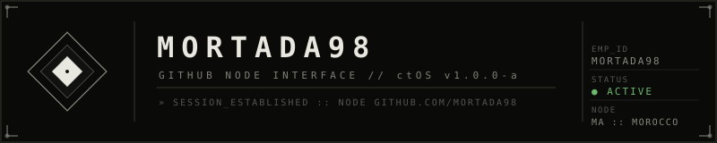

<!--
  ╔══════════════════════════════════════════════════════════╗
  ║  ctOS PROFILE :: GITHUB NODE INTERFACE v1.0.0-a         ║
  ║  Property of Mortada. Sentinel Active Monitoring.       ║
  ╚══════════════════════════════════════════════════════════╝
-->

<div align="center">



<br/>

```
╔─────────────────────────────────────────────────────────────────╗
│  IDENTITY VERIFIED                                              │
│  ─────────────────────────────────────────────────────          │
│  EMPID ##    Mortada98          CLASS    DEV_L5_PROV            │
│  FULL NAME   Mortada            NODE     MA.MOROCCO             │
│  SESSION     ACTIVE             UPTIME   42 NET :: ONLINE       │
╚─────────────────────────────────────────────────────────────────╝
```

</div>

---

<div align="center">

```
» SESSION_ESTABLISHED :: GITHUB.COM/MORTADA98
» REGION_LINK : MA :: MOROCCO
» [PROFILE_IDP] CIPHER_NEGOTIATED ←→ https://github.com
» [PROFILE_IDP] Opened session for user(Mortada98)
» [PROFILE_IDP] IDENTITY_VERIFIED // WELCOME BACK
─────────────────── LOADING PROFILE DATA ───────────────────
```

</div>

---

## `// 01 — ABOUT`

```
┌─────────────────────────────────────────────────────────────┐
│  Mortada                                                    │
│  ────────────────────────────────                           │
│  ROLE          Software Engineer :: 42 Network             │
│  CLEARANCE     L5_PROV :: Senior / Independent              │
│  FOCUS         C++ Architecture + AI Systems               │
│  STATUS        ● ACTIVE — Currently building The Source    │
│  LOCATION      Morocco :: Node MA.NORTH.AFRICA             │
└─────────────────────────────────────────────────────────────┘
```

> Systems engineer advancing through the 42 Network C++ curriculum.  
> Building *The Source* — an AI-powered digital identity verification platform.  
> All output is logged. All commits are monitored.

---

## `// 02 — TECH STACK`

```
┌──────────────────────────────────────────────────────────────┐
│  PROTOCOL REGISTRY :: AUTHORIZED TOOLS                       │
├────────────────────┬─────────────┬──────────────────────────┤
│  CATEGORY          │  LEVEL      │  SYSTEMS                 │
├────────────────────┼─────────────┼──────────────────────────┤
│  LANG_CORE         │  L5_NATIVE  │  C++, Bash               │
│  LANG_SECONDARY    │  L4_PROV    │  Python                  │
│  OS / ENV          │  L5_NATIVE  │  Arch Linux, Hyprland    │
│  AI_STACK          │  L4_CERT    │  Google Gemini, Local LLM│
│  TOOLING           │  L5_NATIVE  │  Git, Vim/Neovim         │
└────────────────────┴─────────────┴──────────────────────────┘
```

---

## `// 03 — ACTIVE DEPLOYMENTS`

```
─────────────── PROJECT REGISTRY :: STATUS ACTIVE ──────────────
```

**`[THE-SOURCE]`** &nbsp;&nbsp; `● ACTIVE`
```
EMPID     proj-src-001
DESC      AI-powered digital identity verification platform.
STACK     Python, Google Gemini, Local LLM
LINK      PRIVATE :: IN_DEVELOPMENT
```

**`[42-CPP-CORE]`** &nbsp;&nbsp; `● ACTIVE`
```
EMPID     proj-cpp-001
DESC      Deep C++ architecture — memory management, low-level optimization.
STACK     C++, Bash, Arch Linux
LINK      PRIVATE :: IN_DEVELOPMENT
```

**`[HYPRLAND-ENV]`** &nbsp;&nbsp; `◌ ONGOING`
```
EMPID     proj-env-001
DESC      Custom Hyprland Wayland compositor environment and dotfiles.
STACK     Bash, Arch Linux, Hyprland
LINK      PRIVATE :: IN_DEVELOPMENT
```

```
─────────────────────────── END REGISTRY ────────────────────────
```

---

## `// 04 — SYSTEM METRICS`

<div align="center">


</div>

---

## `// 05 — COMMUNICATION CHANNELS`

```
┌──────────────────────────────────────────────────────────────┐
│  AUTHORIZED CONTACT PROTOCOLS                                │
├──────────────────────────────────────────────────────────────┤
│  GITHUB      github.com/Mortada98                           │
│  LINKEDIN    linkedin.com/in/mortada98                      │
│  TWITTER/X   @mortada98                                     │
└──────────────────────────────────────────────────────────────┘
```

<div align="center">

[](https://github.com/Mortada98)&nbsp;
[](https://linkedin.com/in/mortada98)&nbsp;
[](https://twitter.com/mortada98)

</div>

> `[ENTER] TO CONFIRM CONNECTION`

---

<div align="center">

```
─────────────────────────────────────────────────────────────
  Property of Mortada. All activity subject to logging.
  profile-krn-1.0.0 ↔ ctOS-1.0.0-a :: Node GITHUB.COM
─────────────────────────────────────────────────────────────
```


</div>
